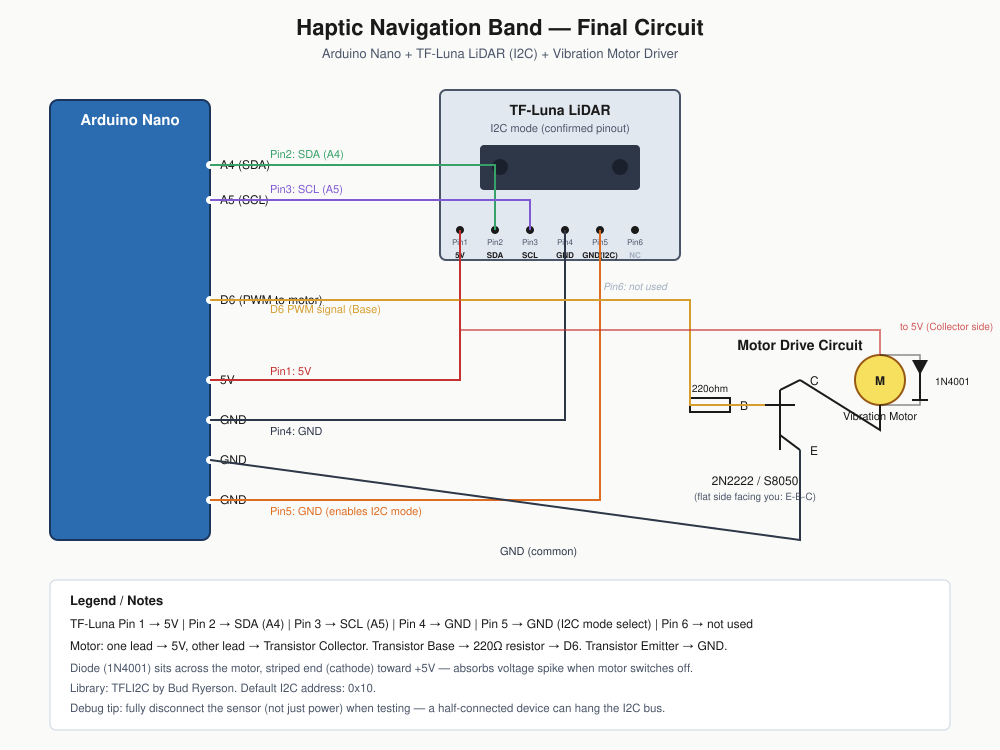
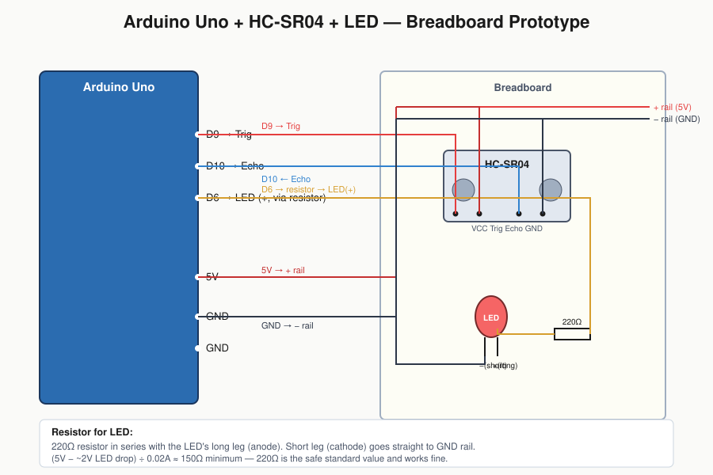

# Haptic Navigation Band
A wearable device that uses distance sensing to give haptic (vibration) feedback about nearby obstacles — built as a low-cost assistive navigation aid concept for visually impaired users.

## 🎥 Demo
*(Coming soon — build in progress)*

## 💡 The Problem
Traditional canes only detect obstacles at ground level and require physical contact. This project explores whether distance-based haptic feedback — closer object = stronger/faster vibration — can give a wearer a sense of their surroundings without sound or contact.

## 🛠️ How It Works
1. A distance sensor continuously scans for nearby objects
2. Distance readings are mapped to vibration intensity/frequency
3. The wearer feels stronger, faster vibration as they approach an obstacle — no vibration means no obstacle in range

## 📦 Hardware
| Component | Purpose |
|---|---|
| Arduino Nano | Microcontroller |
| HC-SR04 (early prototype) → TF-Luna LiDAR (final) | Distance sensing |
| ERM coin vibration motor (10mm, 3V) | Haptic feedback |
| 2N2222 / S8050 transistor + 1N4001 diode | Motor driver circuit |
| 3D printed enclosure (Fusion 360) | Wearable housing |
| 3.7V LiPo battery + TP4056 charger + boost converter | Portable power (planned) |

## 🔌 Circuit Diagram
**Final wiring (Nano + TF-Luna LiDAR + vibration motor):**

**Earlier prototype (Uno + ultrasonic + LED):**

## 🧊 CAD Files
- [Enclosure body (STL)](./models/Haptic_Band_V2_Body.stl)
- [Enclosure cover (STL)](./models/Haptic_Band_V2_Cover.stl)

## 💻 Code
See [`/code`](./code) for Arduino sketches:
- `ultrasonic_led_test.ino` — early prototype, LED stands in for motor
- `lidar_motor_final.ino` — final LiDAR-based version

## 📈 Development Log
- **07/25/2026** — Prototyped distance-to-blink-rate logic with HC-SR04 + LED on breadboard
- **07/28/2026** — Swapped LED for vibration motor, added transistor driver circuit
- **07/28/2026** — Switched sensor to VL53L1X, then TF-Luna LiDAR for better range/accuracy
- **July 29, 2026** — Debugged TF-Luna I2C wiring (bad breadboard row + MODE pin confusion caused I2C bus to hang); got full LiDAR + vibration motor pulsing pipeline working end-to-end
- **July 29, 2026** — Finalized circuit diagram and updated documentation

## 🧠 Challenges & Decisions
- *Why ERM over LRA motor:* simpler PWM control, no dedicated driver chip needed
- *Why LiDAR over ultrasonic:* narrower beam = more precise directional feedback, smaller footprint for wearable design
- *I2C debugging:* a half-connected sensor (power disconnected, but data lines still attached) silently hung the entire I2C bus, since the Wire library has no built-in timeout. Learned to fully disconnect devices when testing, not just power. Also traced a bad breadboard power row that looked connected but wasn't providing real voltage — confirmed with a direct-to-pin connection bypassing the breadboard entirely

## 🚀 Future Improvements
- Multiple sensors for directional feedback (left/right/front)
- Bluetooth logging via ESP32 for a companion app
- Battery-powered standalone wearable version

## 📷 Build Photos
*(breadboard → enclosure → final assembly, in order)*
